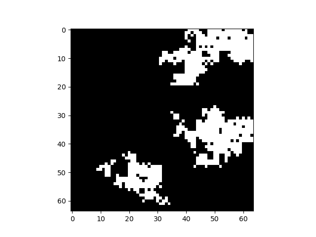
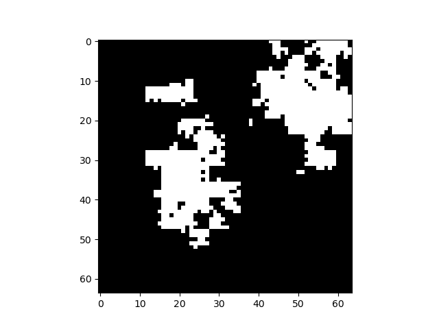

# Procedural-Terrain-Heightmap-Generator
Python-based heightmap generator for procedural terrain, intended to be used by applications such as GIS for synthetic terrain creation.

## Features
- Generates a terrain heightmap in the form of raster data using a technique heavily inspired by Minecraft's terrain generation algorithm.
- Utilizes a stack of cellular automata and perlin noise to generate the heightmap.
- Suitable for generating 3D terrain in various applications, such as ArcGIS Pro.

## How it works
The algorithm roughly follows the same stack that minecraft uses to generate its terrain.

*Image from [Alan Zucconi's blog on the topic](https://www.alanzucconi.com/2022/06/05/minecraft-world-generation/)*

## Examples
<table>
  <tr>
    <td>Seed 0</td>
     <td>Seed 7895648456</td>
  </tr>
  <tr>
    <td></td>
    <td></td>
  </tr>
 </table>

 ## Sources
    - [Alan Zucconi's blog on Minecraft's terrain generation](https://www.alanzucconi.com/2022/06/05/minecraft-world-generation/)
    - [Alan Zucconi's video on Minecraft's terrain generation](https://www.youtube.com/watch?v=YyVAaJqYAfE)
    - [Minecraft Wiki on terrain generation](https://minecraft.fandom.com/wiki/World_generation)
    - [Pierre's blog on perlin noise generation with numpy](https://pvigier.github.io/2018/06/13/perlin-noise-numpy.html)